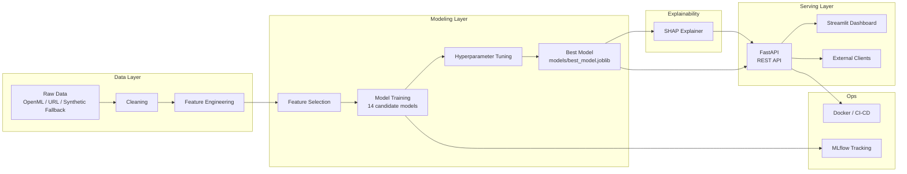
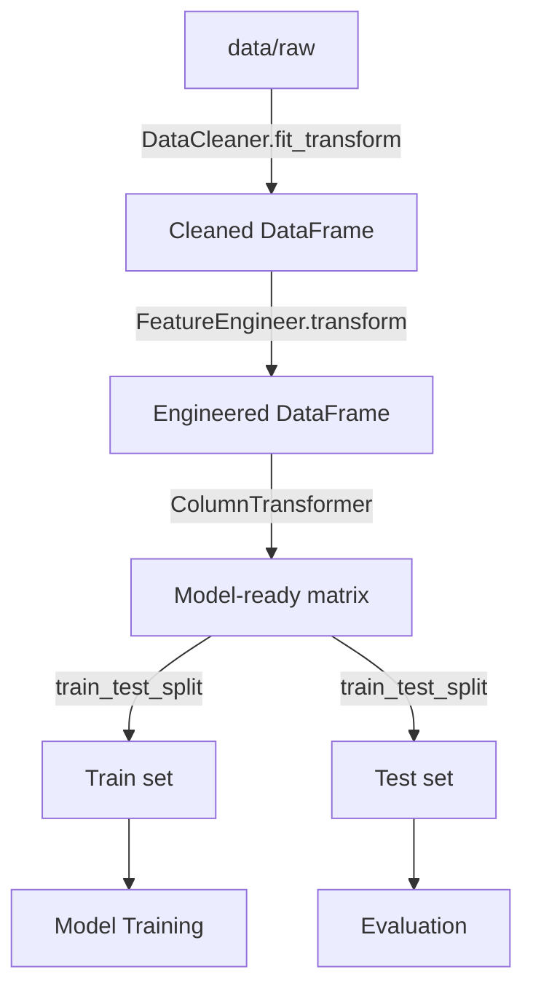
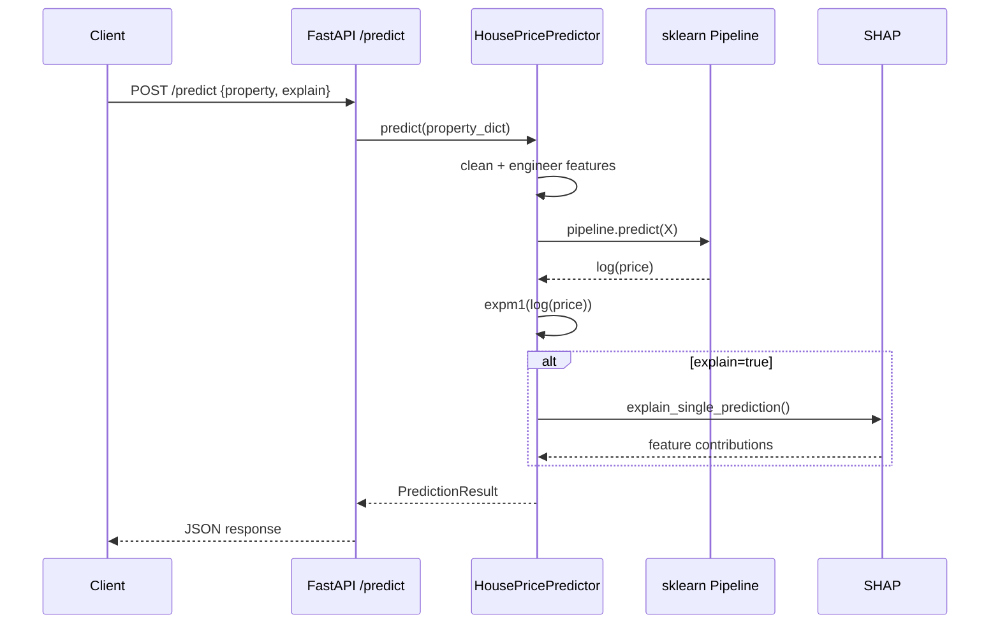

# 🏠 House Price Prediction Platform

An end-to-end, production-grade machine learning platform that predicts residential
property sale prices with **explainable, per-prediction reasoning** — not just a
number. Built to demonstrate the full data science lifecycle: business framing,
data engineering, EDA, feature engineering, model comparison, hyperparameter
tuning, explainable AI, a REST API, an interactive dashboard, containerization,
and CI/CD.

📄 **[Read the full Business Understanding →](docs/01_business_understanding.md)**

---

## Table of Contents

- [Why this project exists](#why-this-project-exists)
- [Architecture](#architecture)
- [Tech stack](#tech-stack)
- [Project structure](#project-structure)
- [Quickstart](#quickstart)
- [Running the pipeline step by step](#running-the-pipeline-step-by-step)
- [The dataset](#the-dataset)
- [Model results](#model-results)
- [API reference](#api-reference)
- [Dashboard](#dashboard)
- [Docker](#docker)
- [Testing](#testing)
- [CI/CD](#cicd)
- [Roadmap](#roadmap)
- [Resume / LinkedIn blurbs](#resume--linkedin-blurbs)
- [License](#license)

---

## Why this project exists

Real estate valuation today is slow (formal appraisals take days), inconsistent
(appraisers can disagree by 10%+ on the same house), and mostly a black box to
the buyer or seller who needs the number. This platform turns raw property
attributes into an instant, **explainable** price estimate: every prediction
comes with a SHAP-based breakdown of exactly which features pushed the price up
or down, and by how much.

See [docs/01_business_understanding.md](docs/01_business_understanding.md) for
the full business case, target users, KPIs, and revenue framing.

## Architecture



### Data flow



### Model flow (single prediction request)



## Tech stack

| Category | Tools |
|---|---|
| Language | Python 3.11 |
| Data | Pandas, NumPy |
| Modeling | scikit-learn, XGBoost, LightGBM, CatBoost |
| Tuning | RandomizedSearchCV, Optuna |
| Visualization | Matplotlib, Seaborn, Plotly |
| Explainability | SHAP |
| Serving | FastAPI, Uvicorn, Pydantic |
| Dashboard | Streamlit |
| Experiment tracking | MLflow |
| Testing | Pytest, pytest-cov, httpx |
| Quality | Black, isort, Flake8 |
| Packaging | Poetry, pip |
| Containerization | Docker, docker-compose |
| CI/CD | GitHub Actions |

> **Optional-dependency design**: XGBoost, LightGBM, CatBoost, Optuna, SHAP,
> Plotly, and MLflow are all treated as *optional* imports throughout the
> codebase (see e.g. `src/training/model_factory.py`). If one isn't installed,
> the platform logs a warning and degrades gracefully instead of crashing —
> useful for locked-down CI runners or minimal environments.

## Project structure

```
house-price-platform/
├── api/                  # FastAPI application (main.py, schemas.py)
├── dashboard/             # Streamlit dashboard (app.py)
├── config/                # config.yaml — single source of truth for all settings
├── data/
│   ├── raw/                # Immutable, as-downloaded/generated data
│   ├── interim/            # Partially processed data
│   ├── processed/          # Fully cleaned, model-ready data
│   └── external/           # Any third-party reference data
├── src/
│   ├── pipelines/           # data_ingestion.py (download + synthetic fallback)
│   ├── preprocessing/        # cleaning.py, pipeline.py (encoding/scaling)
│   ├── feature_engineering/   # features.py, selection.py
│   ├── training/              # model_factory.py, trainer.py, tuning, mlflow
│   ├── prediction/            # predictor.py (shared by API + dashboard)
│   ├── explainability/         # shap_explainer.py
│   ├── visualization/          # eda_plots.py, evaluation_plots.py
│   └── utils/                  # config.py, logger.py
├── models/                 # Saved model artifacts (gitignored)
├── reports/
│   ├── figures/              # Generated EDA / evaluation / SHAP charts
│   ├── logs/                  # Application logs
│   └── mlruns/                 # MLflow tracking store
├── tests/                  # Pytest test suite
├── docs/                   # Business understanding, this README's source docs
├── .github/workflows/       # CI pipeline
├── Dockerfile
├── docker-compose.yml
├── requirements.txt / pyproject.toml
└── README.md
```

## Quickstart

```bash
# 1. Clone and enter the project
git clone <your-fork-url> house-price-platform
cd house-price-platform

# 2. Install dependencies (choose one)
pip install -r requirements.txt
# or, with Poetry:
poetry install

# 3. Train the model (downloads Ames Housing if available, else generates
#    a realistic synthetic fallback dataset automatically)
python -m src.training.trainer

# 4. Run the API
uvicorn api.main:app --reload

# 5. In another terminal, run the dashboard
streamlit run dashboard/app.py
```

Then open:
- API docs: http://localhost:8000/docs
- Dashboard: http://localhost:8501

## Running the pipeline step by step

Every stage can also be run independently, which is useful for development
and for understanding each part of the lifecycle in isolation:

```bash
# Step 2-3: Ingest + clean data
python -m src.pipelines.data_ingestion
python -m src.preprocessing.cleaning

# Step 4: Generate the full EDA report (80+ figures -> reports/figures/eda)
python -m src.visualization.eda_plots

# Step 5: Feature engineering
python -m src.feature_engineering.features

# Step 6: Compare feature selection methods
python -m src.feature_engineering.selection

# Step 7-9: Train + compare all models, then generate evaluation diagnostics
python -m src.training.trainer
python -m src.visualization.evaluation_plots

# Step 8 (optional refinement): Hyperparameter tuning
python -m src.training.hyperparameter_tuning

# Step 10: Explainability report (requires `pip install shap`)
python -m src.explainability.shap_explainer

# Step 14: Browse MLflow experiment history (requires `pip install mlflow`)
mlflow ui --backend-store-uri reports/mlruns
```

## The dataset

This platform is built for the **Ames Housing dataset** (2,930 residential
sales in Ames, Iowa, 2006–2010; 79 explanatory features covering size, quality,
location, and condition).

`src/pipelines/data_ingestion.py` tries, in order:
1. **OpenML** (`fetch_openml`)
2. A **direct CSV mirror URL**
3. A **statistically realistic synthetic fallback** — matching the real
   dataset's schema, ranges, missingness patterns, and price-driving
   correlations, seeded for full reproducibility

...so the entire pipeline always runs end-to-end, even fully offline. When you
run this with internet access, it will automatically use the real dataset
instead.

## Model results

Full leaderboard (14 candidate models) is written to `reports/metrics.json`
and `models/model_registry.json` after every training run. Example results
from a synthetic-fallback run:

| Model | RMSE ($) | MAE ($) | R² | MAPE (%) |
|---|---|---|---|---|
| **Ridge (selected)** | 36,212 | 27,820 | 0.725 | 11.77 |
| Linear Regression | 36,284 | 27,440 | 0.724 | 11.54 |
| ElasticNet | 41,853 | 32,065 | 0.632 | 13.53 |
| Extra Trees | 42,058 | 33,572 | 0.629 | 14.77 |
| SVR | 42,173 | 32,511 | 0.627 | 14.26 |

> Model rankings will differ once trained on the real Ames dataset or your own
> data — regenerate this table with `python -m src.training.trainer`.

## API reference

| Endpoint | Method | Description |
|---|---|---|
| `/` | GET | API metadata |
| `/health` | GET | Liveness/readiness probe |
| `/predict` | POST | Predict a single property's price (optionally with SHAP explanation) |
| `/batch_predict` | POST | Predict prices for multiple properties |
| `/model_info` | GET | Metadata about the currently deployed model |
| `/metrics` | GET | Full model comparison leaderboard |
| `/docs` | GET | Interactive Swagger UI |

Example request:

```bash
curl -X POST http://localhost:8000/predict \
  -H "Content-Type: application/json" \
  -d '{
    "property": {
      "MSSubClass": "60", "MSZoning": "RL", "LotFrontage": 80, "LotArea": 9600,
      "Neighborhood": "CollgCr", "HouseStyle": "2Story", "OverallQual": 7,
      "OverallCond": 5, "YearBuilt": 2003, "YearRemodAdd": 2003,
      "ExterQual": "Gd", "TotalBsmtSF": 856, "1stFlrSF": 856, "2ndFlrSF": 854,
      "GrLivArea": 1710, "FullBath": 2, "BedroomAbvGr": 3, "KitchenQual": "Gd",
      "TotRmsAbvGrd": 8, "MoSold": 2, "YrSold": 2008
    },
    "explain": false
  }'
```

## Dashboard

The Streamlit dashboard (`dashboard/app.py`) provides:
- A full property input form in the sidebar (location, size, rooms, quality, garage, dates)
- A prediction card with a price range gauge
- Optional SHAP-based "why this price?" explanation chart
- A market analysis tab (neighborhood price comparison, size-vs-price scatter)
- A model comparison tab (full leaderboard table + chart)

## Docker

```bash
# Build and run the API + dashboard
docker compose up --build

# Run training inside a container
docker compose --profile train run trainer
```

- API: http://localhost:8000
- Dashboard: http://localhost:8501

## Testing

```bash
pytest --cov=src --cov=api --cov-report=term-missing
```

Test suite covers cleaning, feature engineering, the preprocessing pipeline,
the model factory, the prediction pipeline, and every API endpoint. Tests that
require a trained model (`test_predictor.py`, `test_api.py`) are automatically
skipped if `models/best_model.joblib` doesn't exist yet.

## CI/CD

`.github/workflows/ci.yml` runs on every push/PR:
1. **Lint** — black, isort, flake8
2. **Test** — trains a model, then runs the full pytest suite with coverage
3. **Docker build** — builds both the API and dashboard images

## Roadmap

- [ ] Add quantile regression for true predictive intervals (vs. the current RMSE-based approximation)
- [ ] Add a model/data drift monitoring job (e.g. Evidently AI) for Step-11 "Monitoring"
- [ ] Add authentication (API keys / OAuth) to the FastAPI service
- [ ] Add a `/retrain` endpoint that triggers `trainer.py` as a background job
- [ ] Support the California Housing dataset as an alternate data source
- [ ] Add a geographic map view to the dashboard (requires lat/long enrichment)

## Resume / LinkedIn blurbs

**Resume bullet points:**
- Designed and built an end-to-end house price prediction platform covering data
  ingestion, cleaning, feature engineering, and comparison of 14 regression
  models (linear, tree-based, boosting, ensembles), selecting the best by
  cross-validated RMSE.
- Implemented a production FastAPI service and Streamlit dashboard sharing a
  single inference pipeline, with SHAP-based explainability surfaced in both.
- Built a resilient data pipeline with automatic fallback to a statistically
  realistic synthetic dataset, ensuring the platform runs end-to-end in any
  environment, including fully offline CI.
- Containerized the platform with Docker/docker-compose and set up a GitHub
  Actions CI/CD pipeline running linting, tests with coverage, and image builds.

**LinkedIn project description:**
> Built an enterprise-grade House Price Prediction Platform end-to-end: data
> cleaning and feature engineering, comparison of 14 ML models with
> hyperparameter tuning, SHAP-based explainability, a FastAPI service, a
> Streamlit dashboard, MLflow experiment tracking, Docker containerization, and
> a full CI/CD pipeline — designed to mirror how a real production ML platform
> is built, not just a notebook.

**GitHub repository description:**
> 🏠 Production-grade, explainable house price prediction platform — full ML
> lifecycle from data ingestion to a deployed API + dashboard, with SHAP
> explainability, Docker, and CI/CD.

**Suggested GitHub topics:** `machine-learning` `data-science` `fastapi`
`streamlit` `shap` `explainable-ai` `mlops` `scikit-learn` `xgboost` `docker`
`python` `regression` `house-price-prediction`

## License

MIT — see [LICENSE](LICENSE).
